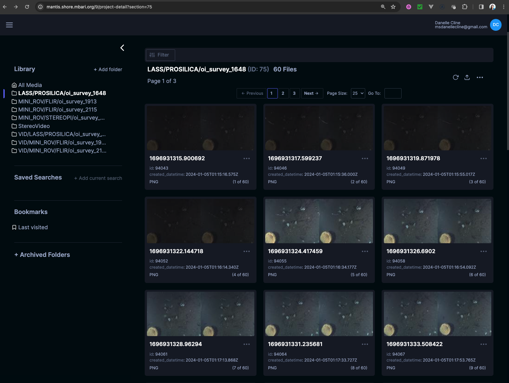
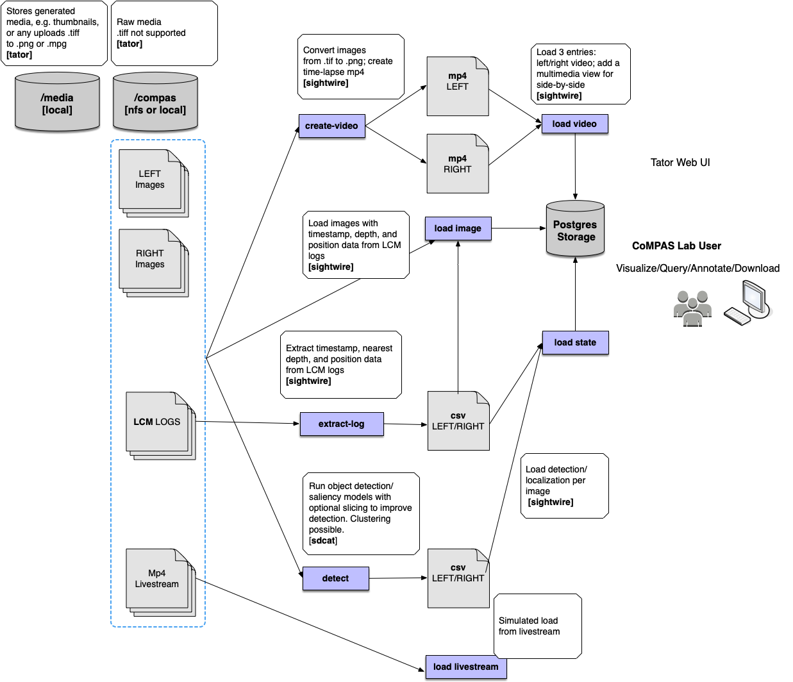

## Sightwire

sightwire is a tool for setting up a database and managing workflows for media collected for the MBARI CoMPAS project.
The general flow is to create a project, upload media, and then run models for detection, classification, etc. on the media.

This is a work-in-progress and more operations will be added as needed.  Contact D.Cline dcline@mbari.org for more information.

A version of this is currently live at http://mantis.shore.mbari.org/9/project-detail?  **ONLY WORKS in a CHROME BROWSER**
Username: **guest**
Password: **mbariguest**




## Overview



## Requirements

For development, you will need:

* [Python >=3.9](https://www.python.org/downloads/)
* [Anaconda](https://www.anaconda.com/) or [Miniconda](https://docs.conda.io/en/latest/miniconda.html) is recommended, but not required
* [ffmpeg](https://ffmpeg.org/)

For deployment, you will need:

* [Docker](https://docs.docker.com/get-docker/)
* [Docker Compose](https://docs.docker.com/compose/install/)
* [ffmpeg](https://ffmpeg.org/)


## Development setup
## 1.  Install dependencies and activate the environment

```bash
conda env create
conda activate sightwire
```

The command line interface can be run with:

```bash
python sightwire
```

which should print something like:

```bash
Usage: sightwire [OPTIONS] COMMAND [ARGS]...

  Run CoMPAS data workflows

Options:
  -V, --version  Show the version and exit.
  -h, --help     Show this message and exit.

Commands:
  convert       Commands related to converting data
  create-video  Create mp4 video files from images
  database      Commands related to database management
  extract-log   Extract timestamp, depth, position, etc.
  init          Initialize the database
  load          Commands related to loading data
```


## 2.  Mount the compas data directory to e.g. /Volumes/compas or /mnt/compas

Note that you can also use a local directory.  Whatever directory you use, that is used in the scripts to launch the database and load data.

Examples:

Linux
```shell
sudo mount -t nfs titan.shore.mbari.org:/data/compas /mnt/compas
```

Mac
```shell
mount smb://titan.shore.mbari.org/compas /mnt/compas
```  

## 3.  Setup and run the database

See the [database setup](./docs/database_setup.md) instructions for details.

 
## 4.  Load some test data

```bash
./scripts/load_image.sh /Volumes/compas
```

The data can now be viewed in the UI at 
http://localhost:8080 and be downloaded programmatically through the API.
 
For example, to query all media for the platform MINI_ROV and camera FLIR

```python
# Simple example on how to query media with attributes
import os
import tator

# export TATOR_HOST=http://localhost:8080
# export TATOR_TOKEN=15a0f486cde0f09329b09f3274de1b962c2273a4
# export TATOE_PROJECT=902204-CoMPAS

api = tator.get_api(os.environ['TATOR_HOST'], os.environ['TATOR_TOKEN'])

projects = api.get_project_list()
project_name = os.environ['902204-CoMPAS']
project = [p for p in projects if p.name == project_name][0]

# These can also be programmatically queried 
mono_image_type = 41 # mono
project_id = 9

# Query for the platform MINI_ROV and camera FLIR
attributes =["$platform::MINI_ROV", "$camera::FLIR"]

# Get all mono images with the above attributes
images = api.get_media_list(project=project_id, type=mono_image_type, attribute=attributes)
print(f'Found {len(images)} images with attributes {attributes}')
```