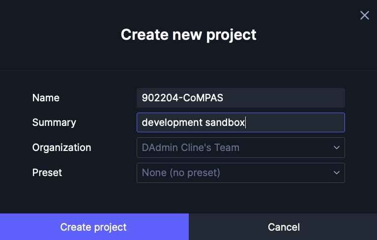
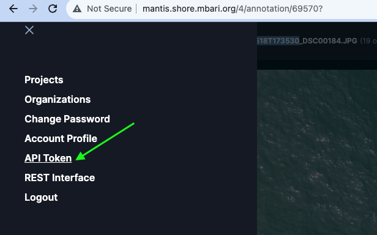

# Setting up TATOR database

This will start a local instance of the TATOR database and UI with a 
volume mount to a /data directory. 

## Prerequisites

Setup the volume mount point(s) for images.  For example, to mount
/home/ops/data to /data.  Additional blocks for volume mounts can be added here.
This specifies how to image data is served as a URL in the container.

In ./scripts/docker/nginx_compas.conf, add the /data block
```text
location /data {
    alias /data;
    autoindex on;
    ...
  }
```
and in ./scripts/docker/docker_start.sh, adjust the volume map.
Add additional volumes mounts as needed with extra -v mounts.

```text 
docker run --rm -p 8081:8081 \
  -v /home/ops/data:/data 
  ...
```
 
Start the TATOR database and UI with the following command:

```shell
./scripts/docker_start.sh
```

When this completes, you should see something like the following output:
```shell
[+] Running 15/15
 ⠿ Container ui                 Started                                                                                                                                                                                                                                                                                                                                                                                                                                    0.4s
 ⠿ Container postgis            Running                                                                                                                                                                                                                                                                                                                                                                                                                                    0.0s
 ⠿ Container postgis-cron       Started                                                                                                                                                                                                                                                                                                                                                                                                                                    1.6s
 ⠿ Container create-extensions  Started                                                                                                                                                                                                                                                                                                                                                                                                                                    1.7s
 ⠿ Container minio              Running                                                                                                                                                                                                                                                                                                                                                                                                                                    0.0s
 ⠿ Container redis              Running                                                                                                                                                                                                                                                                                                                                                                                                                                    0.0s
 ⠿ Container create-bucket      Started                                                                                                                                                                                                                                                                                                                                                                                                                                    1.1s
 ⠿ Container image-worker1      Started                                                                                                                                                                                                                                                                                                                                                                                                                                   1.1s
 ⠿ Container image-worker2      Started                                                                                                                                                                                                                                                                                                                                                                                                                                    1.1s
 ⠿ Container image-worker3      Started                                                                                                                                                                                                                                                                                                                                                                                                                                    1.1s
 ⠿ Container image-worker4      Started                                                                                                                                                                                                                                                                                                                                                                                                                       1.1s
 ⠿ Container image-worker5      Started                                                                                                                                                                                                                                                                                                                                                                                                                                                  1.3s
 ⠿ Container db-worker          Started                                                                                                                                                                                                                                                                                                                                                                                                                                    1.7s
 ⠿ Container transcode-worker   Started                                                                                                                                                                                                                                                                                                                                                                                                                                    1.5s
 ⠿ Container transcode          Started                                                                                                                                                                                                                                                                                                                                                                                                                                    1.1s
 ⠿ Container gunicorn           Running                                                                                                                                                                                                                                                                                                                                                                                                                                    0.0s
 ⠿ Container nginx-tator        Started                                                                                                                                                                                                                                                                                                                                                                                                                                    2.0s
 ⠿ Container gunicorn-cron      Started                                                                                                                                                                                                                                                                                                                                                                                                                                    1.9s
 ⠿ Container migrate            Started
 ```

Now that the containers are running, you can create a *superuser* to use for management of the database.  This is a one-time operation.

Create a superuser
```shell
cd tator && make superuser 
```
  
Open browser to your local tator instance and create a new (not superuser) user

[http://localhost:8080/registration](http://localhost:8080/registration)
 
Use that new user to login and create a new project called e.g. **902204-CoMPAS** with no presets.

[http://localhost:8080/accounts/login](http://localhost:8080/accounts/login)



Create a token for the admin user and set it in your environment along with the host and the project name, e.g.



Set the environment variables for the API host, token, and project name, e.g.

```shell
export TATOR_HOST=http://localhost:8080
export TATOR_TOKEN=eyJ0eXAiOiJKV1QiLCJhbGciOiJIUzI1NiJ9.eyJpZCI6MzYsInVzZXJuYW1lIjoiYWRtaW4iLCJleHAiOjE
export TATOR_PROJECT=902204-CoMPAS
```

Initialize the database
```shell
cd ../sightwire
export PYTHONPATH=$PWD
python sightwire database init
```
Should see something like:
```shell
WARNING: This will delete all existing media and localizations in the project 902204-CoMPAS if they exist. Continue ? [y/N]: y
2024-01-02 17:53:04,903 INFO Found project 902204-CoMPAS with id 1
2024-01-02 17:53:05,198 INFO Found 0 existing media
2024-01-02 17:53:05,199 INFO Deleting 0 existing state types
2024-01-02 17:53:05,501 INFO Found 0 existing media types
2024-01-02 17:53:05,502 INFO Found 0 existing localizations
...
```

